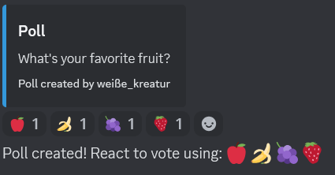
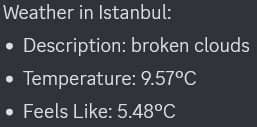

# Discord Bot  

## Overview  
This is a feature-rich Discord bot built using Python. The bot is designed to enhance your Discord server by providing fun interactions, moderation tools, and utility commands. The project is structured with a modular design, categorizing commands into different folders for better organization and scalability.  

---

## Features  

### API Commands  
These commands interact with external APIs to fetch data or perform specific tasks:  
- **Cat Fact** (`catfact.py`): Fetches a random cat fact to share in the server.  
- **Define** (`define.py`): Retrieves definitions of words using a dictionary API.  
- **Joke** (`joke.py`): Sends a random joke to lighten the mood.  

### Development Commands  
These commands are designed for debugging and bot monitoring:  
- **Eval** (`eval.py`): Executes Python code snippets and returns the result (admin-only command).  
- **Status** (`status.py`): Provides the bot's status, including uptime and server count.  

### Fun Commands  
Commands that engage users with entertaining activities:  
- **8-Ball** (`8ball.py`): Responds to questions with classic 8-ball predictions.  
- **Flip** (`flip.py`): Simulates flipping a coin (heads or tails).  
- **Meme** (`meme.py`): Fetches random memes from popular meme APIs.  
- **Roll** (`roll.py`): Rolls a virtual die with customizable sides.  

### General Commands
Commands that provide useful information or general utilities:

- **Help** (`help.py`): Lists all available bot commands with brief descriptions.
- **Server Info** (`serverinfo.py`): Displays detailed information about the current server, such as server name, member count, and creation date.
- **Test** (`test.py`): Verifies the bot's functionality, ensuring it is working properly.
- **Uptime** (`uptime.py`): Shows how long the bot has been running since its last restart.
- **User Info** (`userinfo.py`): Displays detailed information about a specified user, such as username, roles, and join date.

### Moderation Commands
Commands to manage users and maintain order in the server:

- **Ban** (`ban.py`): Bans a disruptive user from the server.
- **Kick** (`kick.py`): Kicks a user from the server temporarily without banning them.
- **Purge** (`purge.py`): Deletes a specified number of messages from a channel to clear spam or unnecessary messages.
- **Unban** (`unban.py`): Unbans a previously banned user and allows them back into the server.

### Utility Commands
Commands that provide additional helpful features for server members:

- **Poll** (`poll.py`): Creates a poll where users can vote on options for a specific question.
- **Reminder** (`reminder.py`): Sets a reminder for the user to notify them at a specified time.
- **Weather** (`weather.py`): Fetches and displays the current weather for a specified location.

---

## File Structure  
Below is the file structure of the project for easy navigation:  
```plaintext
commands/
  ├── api/
  │   ├── catfact.py
  │   ├── define.py
  │   └── joke.py
  ├── dev/
  │   ├── eval.py
  │   └── status.py
  ├── fun/
  │   ├── 8ball.py
  │   ├── flip.py
  │   ├── meme.py
  │   └── roll.py
  ├── general/
  |   ├── help.py
  │   ├── serverinfo.py
  │   ├── test.py
  |   ├── uptime.py
  │   └── userinfo.py
  ├── moderation/
  |   ├── ban.py
  │   ├── kick.py
  |   ├── purge.py
  │   └── unban.py
  ├── utility/
  │   ├── roll.py
  |   ├── reminder.py
  |   └── weather.py
screenshots/
  ├── poll.png
  ├── serverinfo.png
  ├── status.png
  ├── userinfo.png
  └── weather.png
.env
.gitignore
8ball.txt
discord.log
main.py
README.md
requirements.txt
```

## Installation and Setup
## Prerequisites

Ensure you have the following installed on your system:
* Python 3.8 or higher
* pip (Python package manager)

## Steps to Install

1) Clone this repository to your local machine:
```bash
git clone <repository-url>
cd <project-directory>
```

2) Install the required dependencies:
```bash
pip install -r requirements.txt
```

3) Create a .env file in the root directory and add your bot token and openweather API key(If you don't add your api key you can't use the `$weather` command):
```bash
TOKEN=your_bot_token_here
API_KEY=your_api_key_here
```

4) Run the bot:
```bash
python main.py
```

## Commands

### API Commands

These commands interact with external APIs to fetch data or provide information dynamically:

1) **Cat Fact (catfact.py)**

    * **Description**: Retrieves a random cat fact from an external API and sends it to the Discord channel.
    * **Use Case**: Ideal for fun interactions, especially for cat lovers.
    * **Example**: `$catfact`
    * **Output**: 
    > "A cat’s whiskers are generally about the same width as its body."

2) **Define (define.py)**

    * **Description**: Looks up the definition of a word using a * dictionary API and returns the meaning.
    * **Use Case**: Helps users quickly find the definition of unfamiliar words.
    * **Example**: `$define programming`
    * **Output**:
    > "Programming: The process of creating a set of instructions that tell a computer how to perform a task."

3) **Joke (joke.py)**

    * **Description**: Fetches a random joke from a jokes API and sends it to the channel.
    * **Use Case**: Perfect for lightening the mood during server conversations.
    * **Example**: `$joke`
    * **Output**:
    > "Why did the scarecrow win an award? Because he was outstanding in his field!"

### Development Commands

These commands are designed for developers to debug and monitor the bot's functionality:

1) **Eval (eval.py)**

    * **Description**: Executes Python code snippets and returns the result.
    * **Note**: Restricted to bot developers or admins.
    * **Use Case**: Useful for testing small code snippets or evaluating logic directly via Discord.
    * **Example**: `$eval 2 + 2`
    * **Output**:
    > 4

2) **Status (status.py)**

    * **Description**: Provides the current status of the bot, such as uptime, memory usage, and the number of connected servers.
    * **Use Case**: Ensures the bot is functioning correctly and provides * insights into performance.
    * **Example**: `$status`
    * **Output**:
    

### Fun Commands

These commands are designed to entertain and engage server members:

1) **8-Ball (8ball.py)**

    * **Description**: Simulates a magic 8-ball, answering user questions with randomized responses.
    * **Use Case**: Adds a fun and interactive element to server conversations.
    * **Example**: ``$8ball Will I win the lottery?``
    * **Output**:
    > "It is certain."

2) **Flip (flip.py)**

    * **Description**: Flips a virtual coin and displays the result (Heads or Tails).
    * **Use Case**: Useful for making decisions or just having fun.
    * **Example**: ``$flip``
    * **Output**:
    > "🪙 Heads"

3) **Meme (meme.py)**

    * **Description**: Fetches a random meme from a meme API and shares it in the channel.
    * **Use Case**: Fun for creating engagement by sharing popular memes.
    * **Example**: ``$meme``
    * **Output**:
    > [Random Meme Image]

4) **Roll (roll.py)**

    * **Description**: Rolls a virtual die and returns a random number based on the specified number of sides.
    * **Use Case**: Great for games or deciding outcomes with random rolls.
    * **Example**: ``!roll 6``
    * **Output**:
    > "🎲 You rolled: 4"

### General Commands

These commands provide information and general utilities for the server:

1) **Help (help.py)**

    * **Description**: Lists all available bot commands with a brief description.
    * **Use Case**: Helps users navigate the bot's functionality.
    * **Example**: ``$help``

2) **Server Info (serverinfo.py)**

    * **Description**: Displays detailed information about the current Discord server, including server name, member count, and creation date.
    * **Use Case**: Useful for learning more about the server.
    * **Example**: ``$serverinfo``
    * **Output**:
    

3) **Test (test.py)**

    * **Description**: A simple command to test if the bot is working properly.
    * **Use Case**: Verifies bot functionality during debugging or setup.
    * **Example**: ``!test``
    * **Output**:
    > "Test command executed!"

4) **Uptime (uptime.py)**

    * **Description**: Shows how long the bot has been running since its last restart.
    * **Use Case**: Useful for checking the bot's reliability and runtime.
    * **Example**: ``!uptime``
    * **Output**:
    > 01:02:49

5) **User Info (userinfo.py)**

    * **Description**: Displays detailed information about a specified user, such as username, roles, and join date.
    * **Use Case**: Provides insights about users in the server.
    * **Example**: ``!userinfo <userID>``
    * **Output**:
    

### Moderation Commands

These commands are for server moderators to manage users and maintain order:

1) **Ban (ban.py)**
    * **Description**: Bans a user from the server.
    * **Use Case**: Removes disruptive users from the server.
    * **Example**: ``$ban <User ID>``
    * **Output**:
    > "``User Name`` has been banned from ``Guid Name``."

2) **Kick (kick.py)**

    * **Description**: Kicks a user from the server.
    * **Use Case**: Removes a user temporarily without banning them.
    * **Example**: ``$kick <User ID>``
    * **Output**:
    > "``User Name`` has been kicked from ``Guid Name``."

3) **Purge (purge.py)**

    * **Description**: Deletes a specified number of messages from a channel.
    * **Use Case**: Quickly clears spam or unnecessary messages.
    * **Example**: ``$purge 10``
    * **Output**:
    > "Cleared 10 messages by ``Author Name``."

4) Unban (unban.py)

    * **Description**: Unbans a previously banned user.
    * **Use Case**: Allows users back into the server after resolving issues.
    * **Example**: ``$unban <User ID>``
    * **Output**:
    > "Unbanned ``User Name`` (ID: ``User ID``)."

### Utility Commands

These commands provide additional helpful features:

1) **Poll (poll.py)**
    * **Description**: Creates a poll with a question and options for users to vote on.
    * **Use Case**: Engages users by collecting opinions through polls.
    * **Example**: ``$poll What's your favorite fruit? | 🍎 🍌 🍇 🍓``
    * **Output**:
    

2) **Reminder (reminder.py)**

    * **Description**: Sets a reminder for the user at a specified time.
    * **Use Case**: Helps users keep track of tasks or events.
    * **Example**: ``$remindme 2h Take a break``
    * **Output**:
    > "Reminder set for 2h from now!"

3) **Weather (weather.py)**

    * **Description**: Fetches the current weather for a specified location.
    * **Use Case**: Provides real-time weather updates.
    * **Example**: ``$weather Istanbul``
    * **Output**:
    

## License

This project is licensed under the MIT License. See the [LICENSE](./LICENSE) file for details.

## Acknowledgments
 
* [Discord.py Documentation](https://discordpy.readthedocs.io/en/stable/)
* [OpenweatherAPI](https://openweathermap.org/api)
* [Meme API](https://github.com/D3vd/Meme_Api)
* [Cat Fact API](https://catfact.ninja/)
* [Offical Joke API](https://github.com/15Dkatz/official_joke_api)
* [Free Dictionary API](https://github.com/meetDeveloper/freeDictionaryAPI)